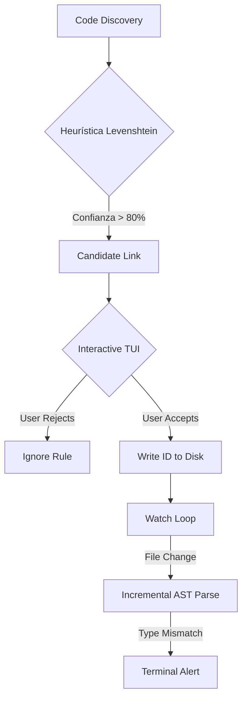

# Blueprint: DocsGuard (The Documentation Integrity Engine)

> **Versión:** 1.4.0 (Trust-First Architecture)
> **Estado:** Draft / Implementation Ready
> **Fecha:** Febrero 2026
> **Misión:** Eliminar la deriva código-doc mediante validación heurística segura, soporte multiformato y corrección interactiva.

---

## 1. Resumen Ejecutivo & Estrategia

### 1.1 El Problema (Refinado V4)
La automatización incorrecta es peor que la falta de herramientas.
1.  **Diffs de la Vergüenza:** Herramientas que modifican código automáticamente basándose en probabilidad (Levenshtein) destruyen la confianza del desarrollador.
2.  **Rigidez de Formato:** Exigir "Tablas Markdown" ignora que el 60% de la documentación moderna usa listas o definiciones para argumentos.
3.  **Complejidad LSP:** Intentar construir un Language Server completo en una fase temprana es un suicidio de ingeniería.

### 1.2 La Solución: Confianza Interactiva
**DocsGuard** prioriza la seguridad y la flexibilidad:
1.  **Scaffold Interactivo (TUI):** Nunca toca el disco sin permiso explícito. Pregunta: "¿Enlazar `fn login` con `## Login`? [Y/n]".
2.  **Parser Políglota:** Entiende Tablas, Listas (`- param: desc`) y Definiciones (`Term: Def`).
3.  **Validación de Tipos:** No solo chequea que el argumento existe, valida si el tipo documentado ("String") coincide con el código (`String`).

### 1.3 Estrategia "Green Build Day 1"
*   **Baseline de Deuda:** Comando `baseline` que vuelca todos los errores existentes a un archivo YAML. El CI pasa en verde el Día 1, bloqueando solo regresiones nuevas.
*   **Watch Mode (No LSP):** Feedback rápido en terminal limpia, sin la complejidad de mantenimiento de un plugin de editor completo.

---

## 2. Especificaciones Funcionales (PRD)

### 2.1 User Stories Core
| ID | Actor | Acción | Resultado Esperado |
|----|-------|--------|--------------------|
| **US-1** | Dev (New) | Ejecuta `docsguard scaffold` | Se abre una interfaz TUI interactiva. Revisa sugerencias de enlaces una por una. Confirma cambios antes de escribir. |
| **US-2** | Dev | Ejecuta `docsguard watch` | Terminal muestra estado en tiempo real. Si cambia una firma, la pantalla se limpia y muestra el error en rojo (<200ms). |
| **US-3** | Dev | Documenta argumento como `Integer` | Si el código define `String`, DocsGuard emite un Warning de "Type Mismatch". |
| **US-4** | CI Bot | Pipeline | Bloquea solo si hay *nuevas* discrepancias no listadas en `.docsguard/baseline.yaml`. |
| **US-5** | Writer | Usa listas `* id: user uuid` | El parser entiende que es la documentación del argumento `id` sin obligar a usar una tabla. |

### 2.2 Requisitos No Funcionales
*   **Seguridad:** Operaciones de escritura (Scaffold/Fix) son *siempre* interactivas o requieren flag `--force`.
*   **Flexibilidad:** El parser de argumentos debe ser agnóstico al formato visual (Tabla/Lista/Texto).
*   **Performance:** `watch` mode debe detectar cambios y repintar en < 200ms.

---

## 3. Arquitectura Técnica

### 3.1 Stack Tecnológico
*   **CLI UX:** `ratatui` o `dialoguer` (Rust) para interfaces interactivas robustas.
*   **Parser:** `tree-sitter` (Código) + `pulldown-cmark` con extensiones custom (Docs).
*   **Watcher:** `notify` (Cross-platform filesystem events).
*   **Config:** `docsguard.toml`.

### 3.2 Diagrama de Flujo "Trust Loop"


## 4. Diseño de Componentes

### 4.1 Scaffold TUI (src/interactive) *[REDISEÑADO]*
*   Interfaz de consola rica.
*   Muestra diff lado a lado: Código vs Doc propuesto.
*   Opciones: `[Y]es`, `[N]o`, `[E]dit ID`, `[A]ll similar`.

### 4.2 Parser Multiformato (src/doc_parser)
*   **Strategy Pattern:** `TableStrategy`, `ListStrategy`, `DefinitionStrategy`.
*   Detecta automáticamente el formato usado en la sección vinculada.
*   Normaliza a estructura común: `Vec<Arg { name, type, desc }>`.

### 4.3 Type Checker (src/types)
*   Mapeo de tipos básicos: `String/str -> Text`, `i32/u64 -> Integer/Number`, `bool -> Boolean`.
*   Permite alias custom en config: `UUID -> String`.

---

## 5. Roadmap de Implementación (V4)

### Semana 1: Confianza y Estructura (The Foundation)
*   [ ] Rust CLI + `tree-sitter` setup.
*   [ ] **Interactive TUI:** Implementar `scaffold` con `dialoguer` (Dry-run default).
*   [ ] **Type Validator:** Extracción básica de tipos en AST.

### Semana 2: Flexibilidad (The Parser)
*   [ ] **Multi-format Parser:** Soporte para Tablas y Listas de argumentos.
*   [ ] Parser de IDs Invisibles (`<!-- id -->`) y Anotaciones (`@docs`).
*   [ ] **Watch Mode:** Implementar loop con `notify` crate (Reemplaza LSP).

### Semana 3: Deuda Técnica (The Baseline)
*   [ ] Sistema de `baseline.yaml`.
*   [ ] Lógica de comparación: `CurrentState - Baseline = NewErrors`.
*   [ ] Detección de Argumentos Fantasma.

### Semana 4: CI y Distribución (The Guard)
*   [ ] Integración GitHub Actions.
*   [ ] Docker container optimizado.
*   [ ] Release v0.1.0 Beta. (IA/Embeddings movido a v0.2.0).

---

## 6. Métricas de Éxito Ajustadas
1.  **Confianza:** 0 reportes de código "roto" por el comando scaffold.
2.  **Adopción:** Soporte validado para los 3 formatos de doc más comunes (Tablas, Listas, Defs).
3.  **Green Build:** Un proyecto legacy grande debe poder pasar CI en < 10 mins tras instalar (gracias a `baseline`).

---

## 7. Principios de Ingeniería & DX (Principal Engineer Guidelines)
*   **Dogfooding Extremo:** Desde el día 2 de desarrollo, DocsGuard debe documentarse a sí mismo usando su propio binario. Si duele, se arregla.
*   **No Regex Parser:** El Markdown es complejo. Prohibido usar Regex para parsear estructura. Uso obligatorio de `pulldown-cmark` para robustez.
*   **El Error es el Producto:** Prohibido imprimir `Error: Mismatch`. El output debe ser educativo:
    ```text
    [X] Error en fn login (src/auth.ts:45)
        -> El argumento 'tenant_id' existe en código pero falta en la documentación.
        -> ID vinculado: 'auth-login' (docs/api.md)
    ```